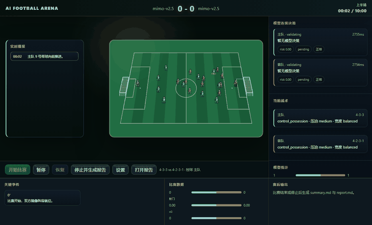
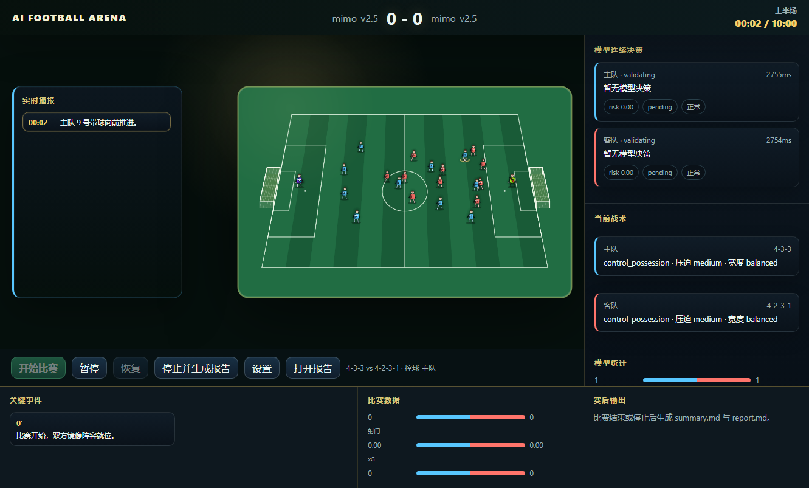
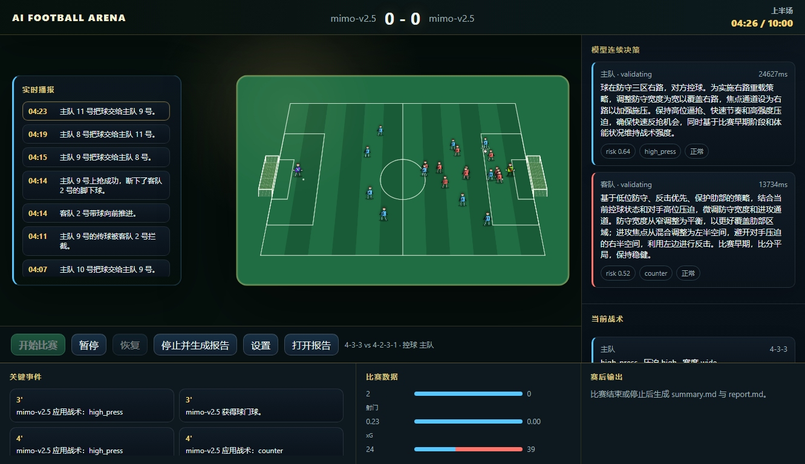

# AI Football Arena

[中文说明](README.zh-CN.md)

AI Football Arena is a local 11v11 football simulation playground. Two AI coaches choose tactics, the match engine advances the game, and the browser UI shows a live 2D pitch, commentary, model decisions, match events, stats, logs, and reports.

It can run without any model API key by using built-in rule coaches, so the project is easy to try locally. If you add OpenAI/DeepSeek-compatible `chat/completions` settings, the coaches can call real models for tactical decisions.



## Features

- Live 11v11 match simulation with possession, passing, shots, interceptions, fouls, cards, substitutions, set pieces, and reports.
- Canvas-based 2D pitch with players, ball movement, score, timer, formations, commentary, and key events.
- Model coach loop with validated tactical JSON, fallback decisions, risk labels, and visible model latency.
- Works offline with local rule coaches when no API key is configured.
- Local HTTP API and WebSocket updates for the browser UI.
- Deterministic and safety-focused tests for engine rules, tactics, commentary, API behavior, and secret masking.

## Screenshots

| Match overview | Match flow |
| --- | --- |
|  |  |


## Install

Requirements:

- Node.js `>=20.11.0`

Clone and install:

```bash
git clone <repo-url>
cd ai-football-arena
npm install
```

This project has no production npm dependencies today, but `npm install` is still the standard setup step and will prepare the lockfile/dependency tree if dependencies are added later.

## Run

Start the local app:

```bash
npm start
```

Open:

```text
http://127.0.0.1:3000
```

For development, `npm run dev` starts the same local server.

## Build

There is no compile or bundle step. The browser UI is served directly from `public/`, and the Node.js runtime starts from `server.js`.

For scripts and CI that expect a build command, this no-op check is available:

```bash
npm run build
```

## Test

```bash
npm test
```

Browser-flow checks are manual for now:

```bash
npm run test:e2e-note
```

## Model Configuration

The app is usable without a real model key. In that mode, local rule coaches generate legal tactical decisions and the match can still finish normally.

To use real model coaches, open the settings panel in the browser and configure provider, model, endpoint, and API key reference. The recommended key format is an environment reference such as:

```text
env:DEEPSEEK_API_KEY
env:OPENAI_API_KEY
```

Compatible `chat/completions` endpoints use a `messages` request shape. If a model request fails, times out, or returns an invalid decision, the engine logs the error and continues with the last valid or fallback tactic.

## Local Data And Secrets

These paths are local runtime data and are ignored by Git:

- `config/app.json`: local app settings and possible API key references.
- `config/*.local.json`: local-only config overrides.
- `matches/`: match logs.
- `reports/`: generated post-match reports.
- `cache/`: temporary diagnostics and screenshots.
- `secrets/`: optional local secret storage.
- `.private/`: private PRD, development notes, and non-public artifacts.

Before publishing a fork or old local history, rotate any real API keys that may have ever been saved locally.

## Project Structure

```text
public/                 Browser UI
  app.js                UI state and API/WebSocket flow
  pitchRenderer.js      Canvas pitch rendering
  styles.css            UI styling
src/                    Runtime and match engine
  engine/movement.js    Movement and spacing logic
  matchEngine.js        Match simulation loop
  matchController.js    Match lifecycle orchestration
  coachOrchestrator.js  Model/rule coach decisions
  httpServer.js         HTTP API and static file server
  ws.js                 WebSocket match updates
test/                   Node test suite
scripts/                Local diagnostics helpers
docs/assets/            README images and GIFs
```

## HTTP API

- `GET /api/config`
- `POST /api/config`
- `POST /api/model/test`
- `POST /api/match/start`
- `POST /api/match/pause`
- `POST /api/match/resume`
- `POST /api/match/stop`
- `GET /api/match/current`
- `GET /api/reports/{match_id}`

## WebSocket

```text
WS /ws/match/{match_id}
```

The WebSocket pushes match snapshots, ticks, events, commentary, coach decisions, reports, and errors. Messages are designed not to expose raw API keys or local sensitive paths.

## License

MIT
