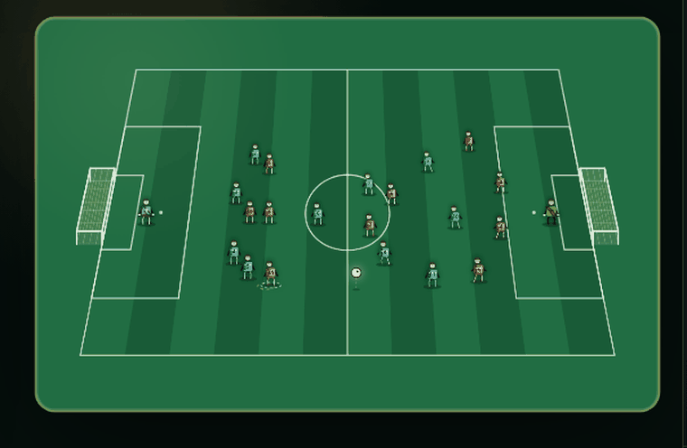

# AI Football Arena

[English](README.md)

AI Football Arena 是一个本地运行的 11v11 足球比赛模拟器。两个 AI 教练负责选择战术，比赛引擎负责推进球权、传球、射门、防守和事件，浏览器界面实时展示 2D 球场、比分、解说、模型决策、关键事件、统计数据、日志和赛后报告。

项目不配置模型 API Key 也能运行：默认会使用本地规则教练生成合法战术，所以可以直接当成一个本地足球模拟小玩具来体验。配置 OpenAI / DeepSeek 兼容的 `chat/completions` 接口后，双方教练可以调用真实模型参与战术决策。


## 功能

- 11v11 实时比赛模拟：支持控球、传球、射门、抢断、犯规、红黄牌、换人、定位球和赛后报告。
- Canvas 2D 球场：展示球员、足球移动、比分、计时器、阵型、实时播报和关键事件。
- 模型教练循环：校验战术 JSON，显示战术摘要、风险标签、请求状态和模型延迟。
- 无密钥可运行：没有 API Key 时使用本地规则教练兜底。
- 本地 HTTP API 和 WebSocket：前端通过接口和实时消息驱动比赛画面。
- 测试覆盖比赛引擎、规则、战术、播报、API、确定性和密钥脱敏。

## 截图

| 比赛总览 | 比赛推进 |
| --- | --- |
|  |  |



## 安装

环境要求：

- Node.js `>=20.11.0`

克隆并安装：

```bash
git clone <repo-url>
cd ai-football-arena
npm install
```

项目目前没有生产 npm 依赖，但 `npm install` 仍然是标准初始化步骤；以后如果加入依赖，也可以沿用同一套流程。

## 运行

启动本地应用：

```bash
npm start
```

打开浏览器：

```text
http://127.0.0.1:3000
```

开发时也可以使用：

```bash
npm run dev
```

## 构建

项目目前不需要编译或打包。浏览器界面直接从 `public/` 提供静态资源，Node.js 运行时从 `server.js` 启动。

如果脚本或 CI 需要一个构建命令，可以运行这个 no-op 检查：

```bash
npm run build
```

## 测试

```bash
npm test
```

浏览器链路目前是手动验证：

```bash
npm run test:e2e-note
```

## 模型配置

不配置真实模型密钥时，应用仍然可以完整跑完比赛。本地规则教练会生成合法战术，比赛日志和报告也会正常生成。

如果想让真实模型参与决策，可以在浏览器的设置面板里填写 provider、model、endpoint 和 API Key 引用。推荐使用环境变量引用：

```text
env:DEEPSEEK_API_KEY
env:OPENAI_API_KEY
```

兼容 `chat/completions` 的接口会使用 `messages` 请求格式。如果模型请求失败、超时，或者返回非法决策，比赛引擎会记录错误，并沿用上一轮有效战术或本地兜底战术继续比赛。

## 本地数据和密钥

以下目录和文件属于本地运行数据，已经加入 `.gitignore`：

- `config/app.json`：本地应用配置，可能包含 API Key 引用或本地保存的密钥。
- `config/*.local.json`：本地配置覆盖。
- `matches/`：比赛日志。
- `reports/`：赛后总结和报告。
- `cache/`：临时诊断截图和缓存。
- `secrets/`：可选的本地密钥目录。
- `.private/`：不公开的 PRD、开发文档和私有产物。

如果你准备公开已有本地仓库或旧历史，建议先轮换曾经保存过的真实 API Key。

## 项目结构

```text
public/                 浏览器界面
  app.js                UI 状态、API 和 WebSocket 流程
  pitchRenderer.js      Canvas 球场渲染
  styles.css            页面样式
src/                    运行时和比赛引擎
  engine/movement.js    球员移动和站位逻辑
  matchEngine.js        比赛模拟循环
  matchController.js    比赛生命周期编排
  coachOrchestrator.js  模型/规则教练决策
  httpServer.js         HTTP API 和静态文件服务
  ws.js                 WebSocket 比赛推送
test/                   Node 测试
scripts/                本地诊断脚本
docs/assets/            README 图片和 GIF
```

## HTTP API

- `GET /api/config`
- `POST /api/config`
- `POST /api/model/test`
- `POST /api/match/start`
- `POST /api/match/pause`
- `POST /api/match/resume`
- `POST /api/match/stop`
- `GET /api/match/current`
- `GET /api/reports/{match_id}`

## WebSocket

```text
WS /ws/match/{match_id}
```

WebSocket 会推送比赛快照、tick、事件、实时播报、教练决策、报告和错误。消息设计上不会暴露明文 API Key 或本机敏感路径。

## 许可证

MIT
